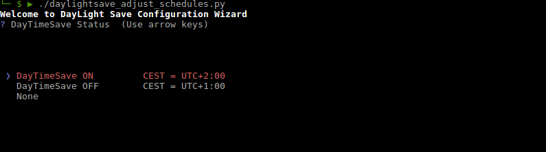
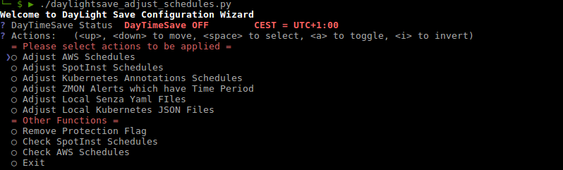

# Daylight Saving Configuration Wizard

This is a tool to adjust schedules according to daylight saving changes, it can

  :arrow_right:  Adjust AWS schedules

  :arrow_right:  Adjust SpotInst schedules

  :arrow_right:  Adjust Kubernetes schedules

  :arrow_right:  Adjust ZMON Alerts

  :arrow_right:  Adjust Senza YAML files

  :arrow_right:  Adjust Kubernetes JSON s3 files

  :arrow_right:  Adjust Local Kubernetes scaling JSON files


  :arrow_right:  Check AWS Schedules

  :arrow_right:  Check SpotInst Schedules

## requirements:

 - You need to Login to your AWS Account
 - You need to be member of the team to adjust ZMON Alerts
 - You need to configure SpotInst Credentials
 - You need manual access to Kubernetes if you are going to do changes in Production Cluster.
  
### Installation:
```bash
   - virtualenv venv
   - source venv/bin/activate
   - pip3 install -r requirements.txt
   - ./daylightsave_adjust_schedules.py
```

### Configuring SpotInst Credentials:

You can configure the credentials by creating a file ~/.spotinst/credentials and add a profile

Example

```
default:
  token: 7df2e7df2e42344860de001de-xxxxxx
  account: act-xxxxxx
```

Or export them in environment variables

```
export spotinst_token="7df2e7df2e42344860de001de-xxxxxx"
export account_id="act-xxxxx"
```

## Filters:
  - Kubernetes:  you can filter by namespace
  - AWS       :  you can filter by environment, stack, stackgroup
  - SpotInst  :  you can filter by environment, stack, stackgroup
  - ZMON      :  you modify Alerts per Team
  - Senza     :  you can just add subfolders instead of the parent folder
  - JSON      :  you can just add subfolders instead of the parent folder

#### Screenshots:

<p align="center">

</p>

<p align="center">

</p>

